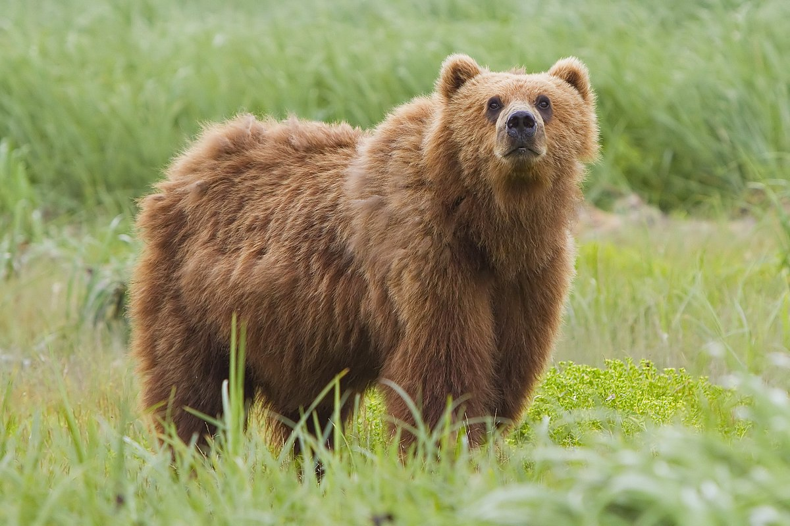
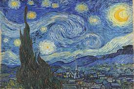

## Neural Style transfer
In this project, we are replicating the original neural style transfer algorithm using VGG19 backbone in tensorflow

### Original content images

### Original style images

 

### Examples

